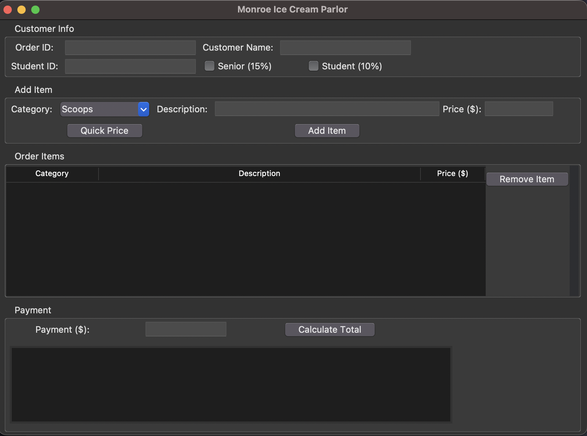

# Monroe Ice Cream Parlor – Desktop App

Small Python desktop app that simulates a Point-of-Sale system for the fictional **Monroe Ice Cream Parlor**.  
It calculates item totals, applies multiple discounts, and shows a receipt-style summary.

## Features
- Add line items (Scoops, Sundaes, Shakes, Candy, etc.)
- Automatic pricing shortcuts for common items
- Senior (15%), >5 items (10%), and Student (10%) discounts applied **in order**
- Tax calculation and change due
- Simple “receipt” display inside the app

## Tech Stack
- Python 3.x  
- Tkinter (standard library GUI toolkit)
- Dataclasses for the pricing model

## Project Structure
```text
src/
  logic.py    # pricing + discount rules (business logic)
  app.py      # Tkinter user interface

screenshots/
  mip-app-screenshot.png

README.md
requirements.txt
```

## Screenshot


